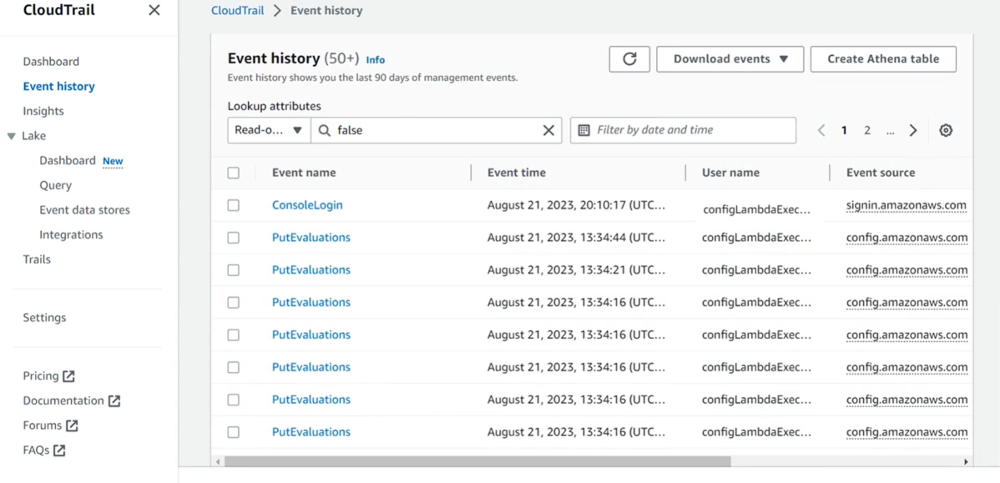
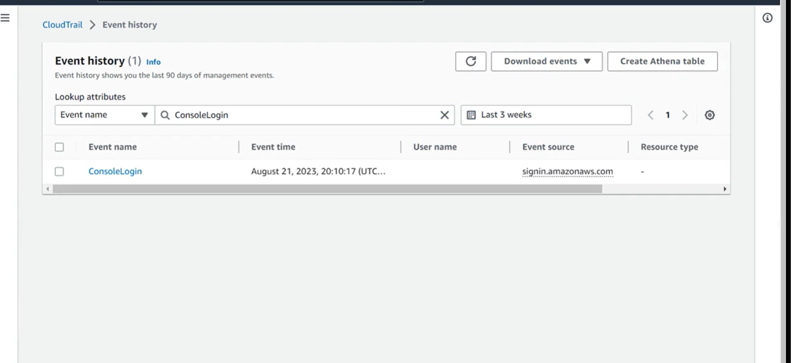

# Amazon CloudTrail

## Overview

AWS CloudTrail is an Amazon Web Services (AWS) service that helps you enable operational and risk auditing, governance, and compliance of your AWS account. Actions taken by a user, role, or an AWS service are recorded as events in CloudTrail. Events include actions taken in the AWS Management Console, AWS Command Line Interface (AWS CLI), and AWS SDKs and APIs.
CloudTrail is enabled on your AWS account when you create it. When activity occurs in your AWS account, that activity is recorded in a CloudTrail event. You can conveniently view recent events in the CloudTrail console by going to Event history. 

Using CloudTrail, you can view, search, download, archive, analyze, and respond to account activity across your AWS infrastructure. CloudTrail helps identify who took which action, which resources were acted on, when the event occurred, and other details. Using the information collected by CloudTrail, you can analyze and respond to activity in your AWS account. Optionally, you can activate CloudTrail Insights on a trail to help you identify and respond to unusual activity.
CloudTrail records AWS account activity, which you can view in the console's Event history.

With AWS CloudTrail, you can monitor your AWS activity comprehensively. You can gain visibility into users and resource activity by obtaining a history of all the AWS API calls made in your account. With CloudTrail, you can monitor API calls made by using the AWS Management Console, the AWS SDKs, the command line tools, and higher-level AWS services. You can identify which users and accounts called AWS APIs for services that support CloudTrail. Additionally, you can identify the source IP address from which the calls were made, and when the calls occurred. This helps during operational, security incident troubleshooting, and also helps in risk auditing, governance, and compliance of your AWS account.

**With CloudTrail, you can do the following:**

- Centralize a collection of activity data to manage multi-Region and multi-account environments.
- Audit by automatically recording and storing activity logs.
- Integrate with SQL query syntax for log analysis.
- Address regulatory and compliance requirements for auditing.
- Monitor data usage, detect exfiltration, and adjust AWS IAM roles' permissions.
- Build security automation by tracking and responding to threats, and use CloudTrail Insights to detect unusual activity.
- Troubleshoot security and operational issues by tracking changes in your accounts.
- Detect operation issues by integrating with Amazon CloudWatch Logs.

##  AWS Management Console CloudTrail

### Demo CloudTrail

1. Open the AWS Management Console and search for CloudTrail in the Services search bar. Then, choose AWS **CloudTrail**.
2. From the AWS CloudTrail main page, choose **Event history** from the left menu pane**.
    The Event history page will provide details about events that have occurred within your AWS account.  
3. To start, select **Event name** from the dropdown menu labeled Lookup attributes. 
4. Next, input **ConsoleLogin** in the textbox positioned to the left of the Event name dropdown menu.
5. To configure the search range for the preceding three weeks of console logins, access the **custom tab** icon. Within this section, you can define the desired timeframe for login searches. Set a duration of three weeks and choose weeks as the **unit of time**. Lastly, confirm your selection by choosing **Apply**.
    Upon successful completion, the Event history will display the outcomes of each login within the past three weeks. In this demonstration, there was only a single login to this account; however, this could vary based on your specific account and the frequency of logins.




## AWS CLI CloudTrail

If you have the AWS CLI installed and configured, you can look up events for CloudTrail by calling the appropriate commands.
If you do not have the AWS CLI installed, you can use AWS CloudShell to issue CLI commands. You can access CloudShell by searching for the service in the AWS Management Console.

### Look up events for a trail

The following lookup-events command looks up API activity events by the attribute EventName.

```bash
aws cloudtrail lookup-events --lookup-attributes AttributeKey=EventName,AttributeValue= ConsoleLogin
```
**Sample Output**

```json
{
    "Events": [
        {
        "EventId": "654ccbc0-ba0d-486a-9076-dbf7274677a7",
        "Username": "my-session-name",
        "EventTime": "2021-11-18T09:41:02-08:00",
        "CloudTrailEvent": "{\"eventVersion\": \"1.02\", \"userIdentity\": {\"type\": \"AssumedRole\", \"principalId\": \"AROAJIKPFTA72SWU4L7T4:my-session-name\", \"arn\": \"arn:aws:sts::123456789012:assumed-role/my-role/my-session-name\", \"accountId\": \"123456789012\", \"sessionContext\": {\"attributes\": {\"mfaAuthenticated\": \"false\",\"creationDate\": \"2016-01-26T21:42:12Z\"}, \"sessionIssuer\": {\"type\": \"Role\", \"principalId\": \"AROAJIKPFTA72SWU4L7T4\", \"arn\": \"arn:aws:iam::123456789012:role/my-role\", \"accountId\": \"123456789012\", \"userName\": \"my-role\"}}}, \"eventTime\": \"2016-01-26T21:42:12Z\", \"eventSource\": \"signin.amazonaws.com\", \"eventName\": \"ConsoleLogin\", \"awsRegion\": \"us-east-1\", \"sourceIPAddress\": \"72.21.198.70\", \"userAgent\": \"Mozilla/5.0 (Macintosh; Intel Mac OS X 10_9_5) AppleWebKit/537.36 (KHTML, like Gecko) Chrome/47.0.2526.111 Safari/537.36\", \"requestParameters\": null, \"responseElements\": {\"ConsoleLogin\": \"Success\"}, \"additionalEventData\": {\"MobileVersion\": \"No\", \"MFAUsed\": \"No\"}, \"eventID\": \"654ccbc0-ba0d-486a-9076-dbf7274677a7\", \"eventType\": \"AwsConsoleSignIn\", \"recipientAccountId\": \"123456789012\"}",
        "EventName": "ConsoleLogin",
        "Resources": []
        }
    ]
}
```

### Look up the last 10 events

To see the ten latest events, type the following command

```bash
aws cloudtrail lookup-events --max-items 10
```

**Sample Output**

```json
{
    "NextToken": "kbOt5LlZe++mErCebpy2TgaMgmDvF1kYGFcH64JSjIbZFjsuvrSqg66b5YGssKutDYIyII4lrP4IDbeQdiObkp9YAlju3oXd12juy3CIZW8=", 
    "Events": [
        {
        "EventId": "0ebbaee4-6e67-431d-8225-ba0d81df5972", 
        "Username": "root", 
        "EventTime": 1424476529.0, 
        "CloudTrailEvent": "{
                \"eventVersion\": \"1.02\",
                \"userIdentity\": {
                    \"type\": \"Root\",
                    \"principalId\": \"111122223333\",
                    \"arn\": \"arn:aws:iam::111122223333:root\",
                    \"accountId\": \"111122223333\"},
                \"eventTime\": \"2015-02-20T23:55:29Z\",
                \"eventSource\": \"signin.amazonaws.com\",
                \"eventName\": \"ConsoleLogin\",
                \"awsRegion\": \"us-east-2\",
                \"sourceIPAddress\": \"203.0.113.4\",
                \"userAgent\": \"Mozilla/5.0\",
                \"requestParameters\": null,
                \"responseElements\": {\"ConsoleLogin\":\"Success\"},
                \"additionalEventData\": {
                    \"MobileVersion\": \"No\",
                    \"LoginTo\": \"https://console.aws.amazon.com/console/home",
                    \"MFAUsed\": \"No\"},
                \"eventID\": \"0ebbaee4-6e67-431d-8225-ba0d81df5972\",
                \"eventType\": \"AwsApiCall\",
                \"recipientAccountId\": \"111122223333\"}", 
        "EventName": "ConsoleLogin", 
        "Resources": []
        }
    ]
}
```

