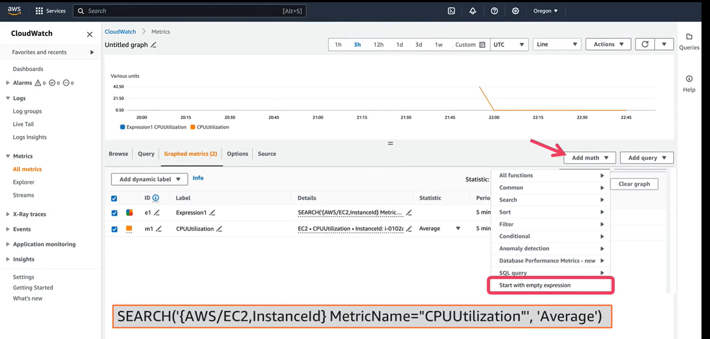
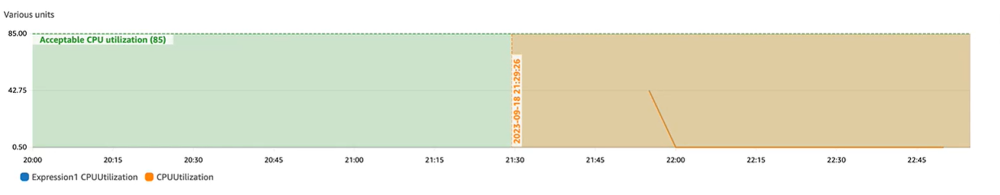

# Amazon CloudWatch

## Overview

CloudWatch helps you observe and monitor resources and applications in AWS, on premises, hybrid, or on other clouds. With CloudWatch, you gain system-wide visibility into your resource utilization, application performance, operational health, and user experience.

1. CloudWatch gives you complete visibility into your cloud resources and applications. You can collect, monitor, act on, and analyze your data.
2. Collect metrics and logs from all of your AWS resources, applications, and services that run on AWS, on premises, hybrid, or on other clouds.
3. Visualize applications and infrastructure with CloudWatch dashboards. Correlate logs and metrics side by side to troubleshoot and set alerts with CloudWatch alarms.
4. Automate responses to operational changes with Amazon EventBridge (formerly Amazon CloudWatch Events) and AWS Application Auto Scaling. You can also use AWS Lambda functions or AWS Systems Manager automation documents to respond to events or alarms.
5. You can analyze your metric data with CloudWatch Metric Math or Metrics Insights, and analyze your log data with CloudWatch Logs Insights. 
6. Through this process, CloudWatch helps with application monitoring, system-wide visibility, resource optimization, and unified operational health.

As IT systems become more complicated and distributed, it can be challenging to spot, diagnose, and resolve issues while understanding their impact. Systems might span multiple applications and services, using resources in AWS, on premises, hybrid, or on other clouds.
Using CloudWatch, you can bring all of this data into one place. You can quickly visualize and analyze it to understand the behavior and health of your resources and applications. You can use CloudWatch to drive your data-driven decision making and actions. For example, CloudWatch helps you capture and notify the support team of errors, detect changes in response times, and identify the impact and location of a problem.
You can collect, search, aggregate, visualize, and respond to data related to your users, application, infrastructure, and network.
You can use CloudWatch to collect metrics and log data. You can configure actions when a threshold is breached using CloudWatch alarms. You can also visualize the data that is relevant for you and your applications using CloudWatch dashboards to help you make data-driven decisions.
CloudWatch integrates with AWS X-Ray so you can collect traces and connect these with the metrics and log data in CloudWatch.

### Understand application health

Use full-stack observability to know what is going on anywhere and everywhere in your system to help provide the best possible experience for your users. Collect all relevant observability data into one place. Detect problems quickly, investigate efficiently, and remediate as quickly to minimize disruption for your customers and reduce mean time to resolution (MTTR).

### Accelerate collaboration

When application issues occur, engage the correct stakeholder for any alerts from the beginning. IT and business teams can automate mundane and repetitive tasks while streamlining complex ones. Working together, they can use insights from observability data to take a more user-centric approach and deliver exceptional user experiences.

### Reduce operational cost

Use observability data to understand how your resources are being used. Across hundreds of thousands of instances, a small percentage performance improvement in how much CPU an application uses can add up to significant savings when using many instances. Similarly, by using observability to understand and predict your future capacity needs, you can take advantage of the cost savings available from Reserve Instance and Spot Instance pricing.

### Increase customer satisfaction

Elevate your customer experiences and business outcomes when you improve application, infrastructure, and network availability. Reduce downtimes and build fast, seamless digital experiences for your customers. Both your internal teams and end customers can operate efficiently to develop and deploy faster.


CloudWatch can compile data from systems spanning multiple applications and services, using resources in AWS, on premises, hybrid, or on other clouds.
CloudWatch is priced differently for each feature, or capability, and data type. You can start with features included with the AWS Free Tier. There are no minimum fees or upfront commitments because you are charged only for what you use. You can also calculate your CloudWatch cost using the AWS Pricing Calculator. For more information about pricing, choose from the following links.

## Technical Concepts of CloudWatch

- **Metrics:** A metric is a time-ordered series of numerical data, such as CPU usage of an EC2 instance. You can use metrics to store all kinds of data, including infrastructure, application, or customer satisfaction data. Metrics are uniquely defined by a namespace, metric name, and zero or more dimensions. Namespaces provide a container for you to store related data together. Metrics provided by AWS services have a namespace that starts with AWS, such as AWS/EC2. Dimensions are name/value pairs that you can use to add context to your metric data, such as the instance ID of an EC2 instance. Dimensions can also be used to search and filter your metric data for dashboards or alarms.n Many AWS services publish metrics to CloudWatch by default. You can also create your own custom metrics. With the CloudWatch agent, you can ingest additional metrics from EC2 instances, on premises, and other cloud-based servers. 
 
- **Logs:** Logs are a series of messages sent by an application or service. They can contain more in-depth and contextualized data than metrics, and can be useful for a deeper dive into the situation. The log message content can be anything that is text based but often has a structure format like JSON or is space separated. When logs are ingested from servers, the logs are written to a file and ingested into CloudWatch using the CloudWatch agent. Some AWS services have native integration with CloudWatch logs, such as AWS Lambda functions, AWS CloudTrail, or VPC Flow Logs. You can extract data from your logs and create metrics using metric filters.

- **Traces:** A trace collects data generated by a single request. That request is typically an HTTP GET or POST request that travels through a load balancer, hits your application code, and generates downstream calls to other AWS services or external web APIs. Traces are the fundamental data type of AWS X-Ray, which can be used with logs and metric data from CloudWatch.


- **Synthetics and canaries:** You use CloudWatch Synthetics to create canaries. Canaries help you to monitor URLs, REST APIs, and website content. Canaries are configurable scripts that follow the same routes and perform the same actions as a customer. You can specify a schedule for your canary so you can continually verify your customer experience, even when there are no customers using your application.

- **Metric Insights and Metric Math:** Metric Insights is an SQL-based query language that you can use to query your metrics at scale. Metric Math is usually used for querying a large amount of data over a short period of time (note the limits on Metric Insights). To learn more, see the Amazon CloudWatch Developer Guide. Metric Math contains search and math functions to help you to query and analyze your data. Metric Math supports a variety of mathematical functions, such as MAX, MIN, AVG, or STDEV, to support your analysis. You can also include IF statements, arithmetic, comparison, and logical operators. You can use Metric Math to query over a longer period of time than Metric Insights. You can query the full history of your metrics data if you wish. With both Metric Insights and Metric Math, you can add the results of your queries to a CloudWatch dashboard or create a CloudWatch alarm. CloudWatch alarms can only be created if the query returns a single time series.

- **Logs Insights:** You can search and aggregate your logs using Logs Insights query language. You can visualize the results of Logs Insights queries on a CloudWatch dashboard as a data table or using various chart types.

- **Dashboards:** CloudWatch dashboards help you to visualize data from your metrics and logs. You can create custom dashboards for different personas and applications, gathering related data about your application in a single place. Dashboards are built from widgets, which you can configure, position, and resize on your dashboard as appropriate. Widgets are available for textual information, various table and chart displays for metrics and logs, and alarm status.

- **Alarms:** You can use alarms to take action when metric data hits a threshold. Thresholds can be static or based on anomaly detection models that detect unexpected behavior based on past data. You can specify actions to take when the alarm state changes (OK, ALARM, or INSUFFICIENT DATA). You can choose multiple actions, such as  sending a notification through Amazon SNS, EC2 action, Systems Manager action, Auto scaling action and ticket action.
    - A metric alarm is created from a single metric, or from a math expression based on metrics, as long as it results in a single time series.
    - A composite alarm contains a rule expression that you can use to logically combine the state of multiple alarms.


## Exploring and graphing default CloudWatch metrics

Metrics are data about the performance of your systems. CloudWatch can load all of the metrics in your account (both AWS resource metrics and application metrics that you provide) for search, graphing, and alarms. 

### Demo CloudWatch

The CloudWatch console us used to graph a default metric data generated by Amazon Elastic Compute Cloud (Amazon EC2). This makes visualizing the activity on your EC2 instance more efficient.

1. To begin, open the AWS Management Console and search for **CloudWatch** in the navigation search bar. Choose CloudWatch from the results.
2. Open the navigation menu for CloudWatch and choose **Metrics**. Then, select **All metrics**.
3. You want to locate data with the metric name `CPUUtilization` as a single word. In the Browse tab, enter `CPUUtilization` in the search field, and press **return**.
4. After you search for the `CPUUtilization` metric, you will see the namespace and dimensions for this metric name. In this case, EC2 is the namespace and the dimension is an instance identifier, hence per-instance metrics. To view the metrics, select one of the results.
5. To graph one or more metrics, select the **check box** next to each metric. To select all metrics, select the check box in the **heading row of the table**. Like, select the check box next to the `CPUUtilization` metric.
6. Choose the **graphed metrics** tab. To change the statistic used in the graph, select the **new statistic** in the **Statistic column**.
7. To change the type of graph, choose the **Options** tab. You can then choose from a line graph, stacked area chart, bar chart, pie chart, or number.
8. On the Graphed metrics tab, in the **Add math menu**, select **Start with empty expression**. For Details, enter the **Query** given below. This will find all data in the Amazon EC2 namespace that has a dimension of InstanceId and a metric name of CPUUtilization. When you launch a new instance later, the CPU utilization of the new instance will automatically be added to the graph. The legend will reflect the details of the individual metrics found by the search term.
9. To add a horizontal annotation, choose the **Options** tab. Then, select Add horizontal annotation.
10. Enter Acceptable CPU utilization as the label for the annotation. Enter 85 as the value where the horizontal annotation should appear. For Fill, specify whether to use fill shading with this annotation. In this demo, Below is specified for the corresponding area to be filled. If you specify Between, another Value field appears, and the area of the graph between the two values is filled.
11. To change the fill color, choose the **color square** in the left column of the annotation.
12. To hide an annotation, **clear the check box** in the left column for that annotation. To delete an annotation, in the Actions column, choose **x**.
13. To add a vertical annotation, choose the **Options** tab. Then, select Add **vertical annotation**.
14. You can enter a label for the annotation. For Date, specify the date and time where the vertical annotation appears. For Fill, specify whether to use fill shading before or after a vertical annotation or between two vertical annotations.
15. As with horizontal annotations, you can hide an annotation by clearing the check box in the **left column** for that annotation. To delete it, in the Actions column, choose **x**.

**Query**

```
SEARCH('{AWS/EC2,InstanceId} MetricName="CPUUtilization"', 'Average')
```




## ClodWatch Logs

Using CloudWatch Logs, you can centralize the logs from all of your systems, applications, and AWS services. You can then easily view them, search them for error codes or patterns, filter them based on specific fields, or archive them securely for future analysis.
With CloudWatch Logs, you can see all of your logs, regardless of their source, as a single and consistent flow of events ordered by time.

**Query**

```
fields @timestamp, remoteIP, request, status, filename
| sort @timestamp desc
| filter filename="/var/www/html/index.html"
```

RunQuery.png

## CloudWatch Alarms

You can do this using CloudWatch alarms. When creating an alarm, you can set a utilization threshold, and then take action when this threshold is met. In this case, the action is to add additional resources through Amazon EC2 Auto Scaling.

### Demo Create an Alarm

1. To begin, open the AWS Management Console and search for CloudWatch in the navigation search bar. Choose **CloudWatch** from the results.
2. In the navigation pane, choose **Alarms**. Then, select **All alarms**. Now, choose **Create alarm** on the top right.
3. The first thing you need to do is to choose the metric that the alarm will monitor. Choose **Select metric**.
4. Choose the service namespace that contains the metric that you want. Continue choosing options as they appear to narrow the choices.
5. Next, select **Per-Instance Metrics**.
6. When a list of metrics appears, select the **check box next to the desired metric**.
7. Next, select the **Graphed metrics** tab.
8. Choose the **statistic and period** that makes sense for your situation. Under Period, choose 1 minute as the evaluation period for the alarm. When evaluating the alarm, each period is aggregated into one data point.
9. Remember that monitoring data is available in 1-minute periods for the instance only after you enable detailed monitoring for the instance. Choose **Select metric**.
    The Specify metric and conditions page appears, showing a graph of the metric data and other information about the metric and statistic that you selected.
10. In the Conditions section, select a **Static threshold type**. Then select **Greater** and a value of 90 as the threshold value. The threshold value will show on the graph.
11. Choose **Next**.
12. On the Configure actions page, select an **Amazon Simple Notification Service (Amazon SNS) topic** to notify when the alarm is In alarm state. You will have to create or have an existing Amazon SNS topic before it can be auto-populated in the box for Send a notification to. You can also create a new SNS topic or use a topic Amazon Resource Name (ARN) to notify other accounts.
13. When you are finished, scroll down and choose **Next**.
14. Enter "CloudWatch Alarm Demo" as the **name for the alarm**. The name must contain only `UTF-8` characters and cannot contain `ASCII` control characters. You can also add a **description** to provide context to the alarm, actions to take, and links to useful resources. Then, choose **Next**.
15. Under the **Preview and create** section, review the information and conditions.
16. If everything is set as you would like, choose **Create alarm**.
    You will be returned to the alarm screen and should find your alarm in the list.

### Demo Delete an Alarm

When you have finished exploring the alarm, you will want to delete it so that no further costs are incurred.

- To delete an alarm, from the navigation pane, choose **Alarms**. Select the **check box** next to the name of the alarm, and then choose **Actions**. Select **Delete**.

## CloudWatch Synthetics with Canaries

With CloudWatch Synthetics, you can create a canary that contains instructions about what should be checked in an application. The canary carries out these tests in the same manner as a user would interact with the application. You can create a variety of canaries, from a simple URL test to complex workflows.